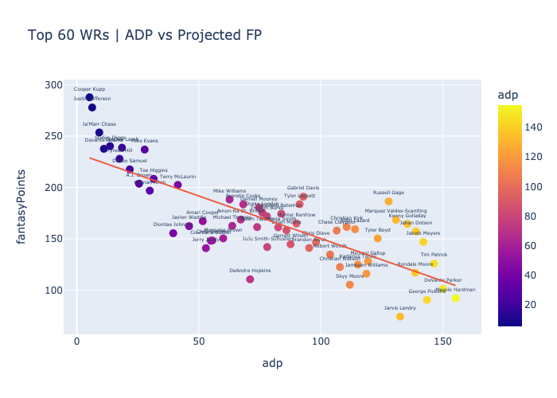
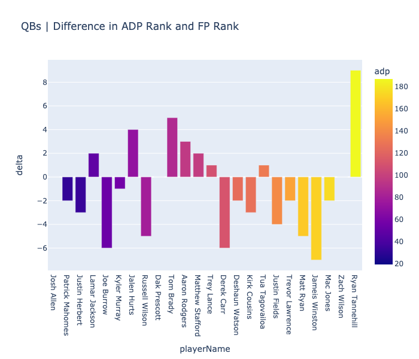

# adp-vs-projection
A fantasy football analysis using Sleeper average draft position (ADP) data and stat projections from Pro Football Focus (PFF).

Pandas was used to clean and merge two DataFrames that were used for analysis. Separate dataframes were created to analyze each individual position group (QB, RB, WR, TE). Additional columns were added to rank players based on their ADP and their projected fantasy points.

Plotly was used for plotting purposes. 
* Scatter plots were made to show the relatonship between ADP and projected fantasy points.
    * Hover text is used to add important context of which player is represented by each dot, as well as their exact ADP and projected fantasy points.

* Relative bar charts were made to show the difference between a players ADP ranking and their projected fantasy points ranking.
    * A positive bar indicates a player is expected to outperform their ADP, while a negative bar indicates an expected underperformance by the player.

